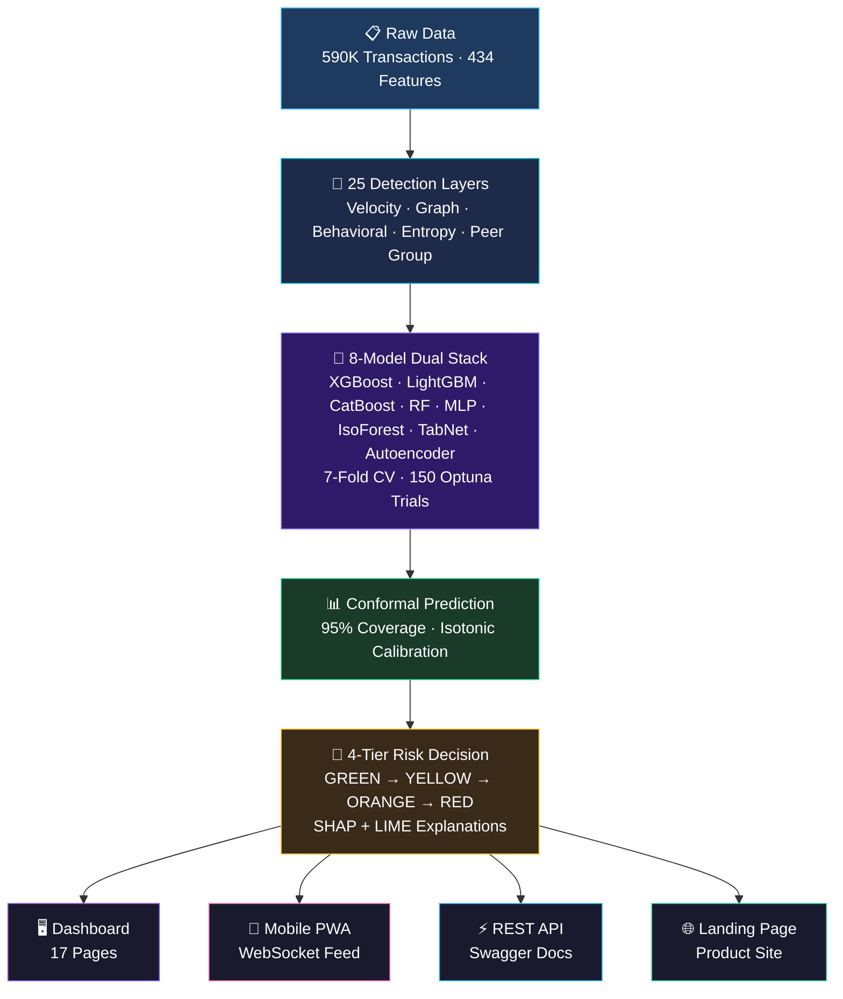

# 🛡️ FraudShield AI

**Adaptive Real-Time Fraud Detection with Explainable Risk Intelligence**

[](https://fraudshield-ai.onrender.com)
[](https://fraudshield-ai.streamlit.app)
[](https://fraudshield-ai.onrender.com/docs)
[](https://github.com/jetashjethi/FraudShield-AI/actions)
[](LICENSE)

An end-to-end production-grade fraud detection system featuring 25 engineered detection layers, an 8-model dual stacking ensemble with conformal prediction, a 17-page interactive dashboard, a mobile PWA with WebSocket live feed, and a REST API — deployed live on Render + Streamlit Cloud.

---

## ⚡ Quick Start

```bash
# 1. Install dependencies
pip install -r requirements.txt

# 2. Train the pipeline (requires GPU for optimal performance)
python main.py

# 3. Launch the API + Landing Page
uvicorn api:app --host 0.0.0.0 --port 8000

# 4. Launch the Dashboard
streamlit run dashboard.py
```

**Access Points:**
| Service | URL |
|---------|-----|
| 🌐 Landing Page | `http://localhost:8000` |
| 📱 Mobile App | `http://localhost:8000/mobile/` |
| 📄 API Docs (Swagger) | `http://localhost:8000/docs` |
| 🖥️ Dashboard | `http://localhost:8501` |

---

## 🏗️ Architecture



---

## 🔬 25 Detection Layers

| # | Layer | Description |
|---|-------|-------------|
| 1 | Amount Analysis | Log transforms, decimal patterns, round-amount flags |
| 2 | Temporal Patterns | Hour/day/weekend effects, night-time risk scoring |
| 3 | Card Fingerprinting | Card-level aggregates and behavioral baselines |
| 4 | Address Intelligence | Address-level risk profiling and mismatch detection |
| 5 | Email Domain Risk | Domain risk scoring, free vs corporate email classification |
| 6 | Device Forensics | Device info parsing, synthetic device detection |
| 7 | Velocity Engine | Transaction speed anomalies per card/address/device |
| 8 | Merchant Risk | Merchant category risk profiling and anomaly scoring |
| 9 | Behavioral DNA | Per-user spending patterns and deviation detection |
| 10 | SIM Swap Detection | Phone-card mismatch and rapid device change patterns |
| 11 | Seasonal Baselines | Day-of-week and monthly spending baseline comparisons |
| 12 | Adaptive Authentication | Multi-factor risk combining layers for auth decisions |
| 13 | Mule Network Detection | Money mule pattern identification via transaction chains |
| 14 | Dormant Account Hijack | Reactivation patterns in dormant accounts |
| 15 | Round Amount Anomaly | Perfectly round amounts at suspicious times |
| 16 | Category Mismatch | Product-address-card inconsistency scoring |
| 17 | New Account Risk | Account age and first-transaction risk profiling |
| 18 | Graph Analysis | NetworkX graph features, community detection (Louvain) |
| 19 | UID Profiling | User identity aggregation across transactions |
| 20 | Target Encoding | Bayesian target encoding with smoothing |
| 21 | V-Feature PCA | Principal component extraction from V1-V339 |
| 22 | Frequency Encoding | Categorical frequency-based risk signals |
| 23 | Peer-Group Deviation | Z-score deviation from peer spending patterns |
| 24 | Transaction Entropy | Shannon entropy of user transaction sequences |
| 25 | Cross-Feature Fraud Rates | Interaction-level fraud rate encoding |

---

## 🤖 8-Model Ensemble

| Model | Type | Role |
|-------|------|------|
| **XGBoost** | Gradient Boosting (GPU) | Primary base learner |
| **LightGBM** | Gradient Boosting | Fast base learner |
| **CatBoost** | Gradient Boosting (GPU) | Categorical feature specialist |
| **Random Forest** | Bagging Ensemble | Variance reduction |
| **MLP Neural Net** | Deep Learning | Non-linear patterns |
| **Isolation Forest** | Anomaly Detection | Unsupervised anomaly scoring |
| **TabNet** | Attention Network (GPU) | Feature selection + attention |
| **Autoencoder** | Deep Anomaly Detection | Reconstruction error scoring |

**Meta-Learning:** XGBoost meta-learner + rank-weighted blend → auto-selects best

---

## 📊 Production Features

### Conformal Prediction
- **95% coverage guarantee** — every prediction comes with a confidence interval
- **3 classes:** Certain Fraud · Uncertain (Human Review) · Certain Legitimate
- Powered by isotonic probability calibration

### Explainability (XAI)
- **SHAP** TreeExplainer for global/local feature importance
- **LIME** plain-English explanations per transaction
- **Counterfactual Analysis** — "What would need to change to flip this decision?"

### Fairness & Compliance
- **Bias Detection** across card types, product categories
- **PCI-DSS** compliant · **RBI Framework** aligned
- **GDPR Art. 22** enabled (LIME) · **EU AI Act** ready (Conformal)

### Monitoring
- **Drift Monitor** — continuous AUC tracking with retraining alerts
- **Adversarial Robustness** testing with noise injection

---

## 🖥️ 14-Page Dashboard

| Page | Description |
|------|-------------|
| Dashboard | System overview, architecture, model comparison |
| Live Detector | Real-time transaction scoring with risk gauge |
| Models | Detailed model performance metrics and comparison |
| Analytics | Score distribution, threshold analysis, ROC curves |
| Flagged | High-risk transaction explorer |
| ROI Calculator | Business impact — annual savings calculation |
| Robustness | Adversarial noise testing |
| Simulator | Interactive threshold simulator |
| Autoencoder | Reconstruction error analysis |
| Live Stream | Real-time streaming transaction simulator |
| Explainer | LIME-style plain-English risk explanations |
| Fairness Audit | Bias analysis with compliance badges |
| Counterfactual | "What-if" analysis for decision flipping |
| Drift Monitor | AUC health monitoring over time |

---

## 📱 Mobile App (PWA)

Progressive Web App installable on any phone:
- **Home** — system status, model overview, architecture
- **Scan** — score transactions with full parameter control
- **Feed** — live transaction history with status badges
- **About** — technical specs and compliance status

---

## 🐳 Docker Deployment

```bash
docker-compose up --build
```

---

## 📁 Project Structure

```
FraudShield-AI/
├── main.py              # Training pipeline orchestrator
├── api.py               # FastAPI REST API (serves landing + mobile)
├── dashboard.py         # 14-page Streamlit dashboard
├── landing/             # Product landing page
│   └── index.html
├── mobile/              # PWA mobile app
│   ├── index.html
│   ├── style.css
│   ├── app.js
│   ├── manifest.json
│   └── sw.js
├── src/
│   ├── feature_engine.py    # 25 detection layers
│   ├── models.py            # 8-model dual stacking ensemble
│   ├── tuner.py             # Optuna hyperparameter optimization
│   ├── graph_engine.py      # NetworkX graph analysis
│   ├── risk_scorer.py       # 4-tier risk scoring
│   ├── shap_engine.py       # SHAP explainability
│   ├── conformal.py         # Conformal prediction + calibration
│   ├── visualizer.py        # Visualization generation
│   └── report_generator.py  # PDF report generation
├── Dockerfile
├── docker-compose.yml
└── requirements.txt
```

---

## 📋 Requirements

- Python 3.9+
- CUDA-capable GPU (recommended for XGBoost, CatBoost, TabNet)
- 16GB+ RAM

---

<div align="center">
<sub>Built for FrostHack 2026 · IIT Mandi</sub>
</div>
