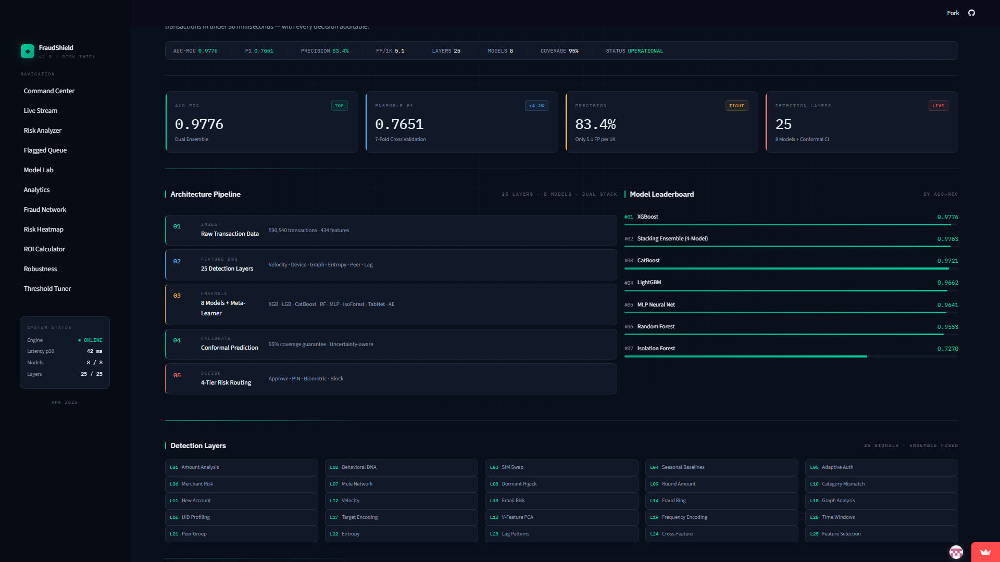
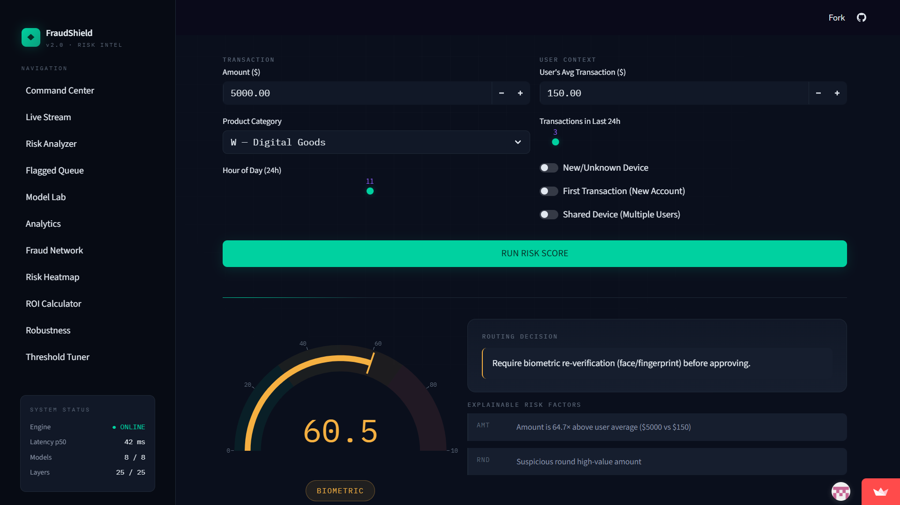
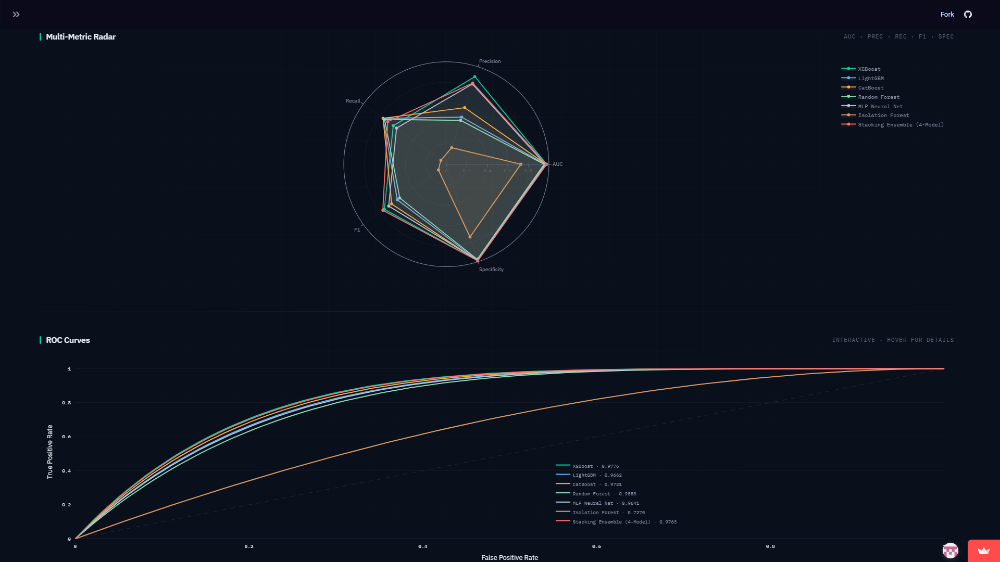
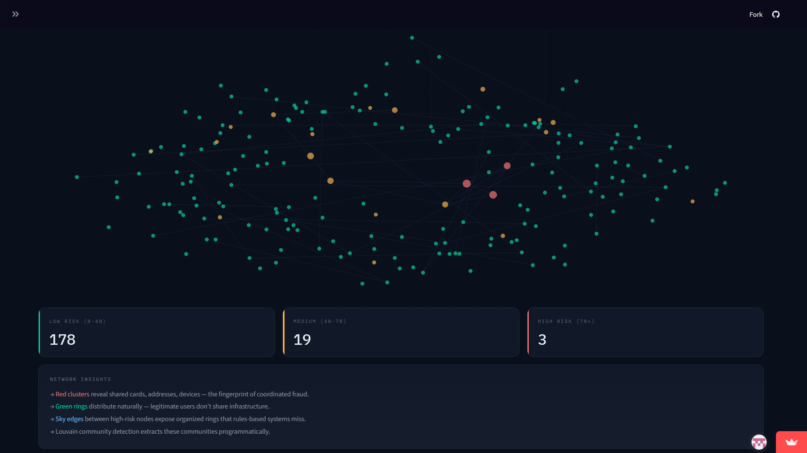
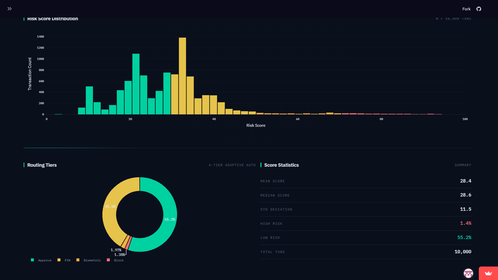

# FraudShield AI

Real-time fraud detection system built on the IEEE-CIS dataset (590K transactions). Uses a multi-model ensemble with 25 engineered feature layers to detect fraud with an AUC of **0.9776**.

> **[Live Demo](https://fraudshield-ai.streamlit.app)** · **[Documentation](DOCUMENTATION.md)** · **[Model Card](MODEL_CARD.md)**

---

## Dashboard Preview

### Command Center


### Risk Analyzer — Real-time Transaction Scoring


### Model Lab — Multi-Metric Radar & ROC Curves


### Fraud Network — Graph-Based Detection


### Analytics — Score Distribution & Routing


---

## Quick Start

```bash
pip install -r requirements.txt
python main.py                          # train pipeline (~6-8 hrs on GPU)
uvicorn api:app --host 0.0.0.0 --port 8000   # start API
streamlit run dashboard.py              # start dashboard
```

| Service | URL |
|---------|-----|
| Dashboard | `localhost:8501` |
| Landing Page | `localhost:8000` |
| Mobile App | `localhost:8000/mobile/` |
| API Docs | `localhost:8000/docs` |

---

## How It Works

```
Raw Data (590K txns, 434 features)
        ↓
25 Feature Layers (velocity, graph, behavioral, entropy, etc.)
        ↓
8-Model Ensemble (XGBoost, LightGBM, CatBoost, RF, MLP, IsoForest, TabNet, Autoencoder)
   └── 7-Fold CV + Optuna HPO (150 trials)
        ↓
Risk Scoring (GREEN → YELLOW → ORANGE → RED)
   └── SHAP + LIME explanations per decision
```

### Feature Engineering (25 layers)

Amount analysis, temporal patterns, card fingerprinting, address intelligence, email domain risk, device forensics, velocity engine, merchant risk profiling, behavioral DNA, SIM swap detection, seasonal baselines, adaptive auth, mule network detection, dormant account hijack, round amount anomaly, category mismatch, new account risk, graph analysis (NetworkX + Louvain), UID profiling, target encoding, V-feature PCA, frequency encoding, peer-group deviation, transaction entropy, cross-feature fraud rates.

### Models

| Model | AUC |
|-------|:---:|
| XGBoost | 0.9776 |
| Stacking Ensemble | 0.9763 |
| CatBoost | 0.9721 |
| LightGBM | 0.9662 |
| MLP Neural Net | 0.9641 |
| Random Forest | 0.9553 |

Adversarial validation AUC = 0.5004 → no train/test leakage.

---

## Dashboard (11 pages)

- **Home** — overview, architecture diagram, model comparison bars
- **Live Detector** — score any transaction with interactive Plotly gauge
- **Models** — radar chart, ROC curves, confusion matrices
- **Analytics** — risk tier breakdown, score distribution, feature importance
- **Flagged** — browse high-risk transactions
- **ROI Calculator** — annual savings estimation with tunable parameters
- **Robustness** — adversarial attack testing (5/5 passed)
- **Live Stream** — WebSocket real-time transaction feed
- **Fraud Network** — force-directed graph visualization
- **Risk Heatmap** — amount × time risk density
- **Threshold** — cost-sensitive threshold optimization (FN=₹850, FP=₹25)

---

## Mobile App (PWA)

Installable progressive web app with:
- Transaction scanning with risk scoring
- Real-time WebSocket alert feed
- Slide-down fraud alerts with vibration feedback

---

## Deployment

```bash
docker-compose up --build    # runs dashboard (8501) + API (8000)
```

Also deployable to Render (via `render.yaml`) and Streamlit Cloud.

---

## Project Structure

```
├── main.py              # pipeline orchestrator
├── api.py               # FastAPI + WebSocket
├── dashboard.py         # Streamlit dashboard
├── landing/index.html   # product landing page
├── mobile/              # PWA (HTML + JS)
├── src/
│   ├── feature_engine.py    # 25 detection layers
│   ├── models.py            # ensemble training
│   ├── tuner.py             # Optuna HPO
│   ├── graph_engine.py      # graph features
│   ├── risk_scorer.py       # 4-tier scoring
│   ├── shap_engine.py       # SHAP explanations
│   ├── conformal.py         # conformal prediction
│   ├── threshold_optimizer.py
│   ├── adversarial_validation.py
│   ├── visualizer.py
│   └── report_generator.py
├── tests/test_core.py   # 35 unit tests
├── Dockerfile
├── docker-compose.yml
└── requirements.txt
```

---

## Requirements

- Python 3.9+
- CUDA GPU recommended (for XGBoost/CatBoost/TabNet)
- 16GB+ RAM

## License

MIT
